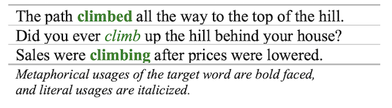

# Metaphor Detection

NLP Group Research Project to replicate <a href="https://arxiv.org/pdf/1808.09653.pdf" target="_blank">Neural Metaphor Detection in Context</a>

We use the biLSTM implemented by Gao et. al. to perform metaphor detection on MOH-X, TroFi, and VUA datasets.

Using the same data, we also adapt a BERT model from Gong et. al. Code for that model can be found [here](https://github.com/cmsc-25700/gong-metaphor-detection)
### Project Overview
**Language Requirements:**
Python 3.9

**Required Libraries:**
For requirements related to reproducing study results, see [gao-g-requirements.txt](gao-g-requirements.txt)

### Google Colab Project Setup (Recommended)
1. Clone repo onto Google Drive: [Example](https://github.com/christiejibaraki/guides/blob/main/python/colab/Clone_git_repo.ipynb)
2. Download data into project directory on Google Drive: [Example](https://github.com/christiejibaraki/guides/blob/main/python/colab/Download_large_data.ipynb)

### Local Project Installation
1. In the project root run `bash install.sh` to verify python installation and create pip environment.
2. Activate the virtual environment by running `source gao-env/bin/activate`.
3. Download the [data](https://drive.google.com/file/d/18tBHegty7sWreqj9Fp8zETKloeOpsGHO/view?usp=sharing) and unzip it into the resources directory.
4. (Optional) GloVe: download pretrained vectors, glove.840B.300d.zip from [https://nlp.stanford.edu/projects/glove/](https://nlp.stanford.edu/projects/glove/) and unzip into resources/glove directory.
5. (Optional) ELMo vectors: [download](https://drive.google.com/file/d/1e1L7wr4H7vRcHefbmdPdbuv_nz76_-Vb/view?usp=sharing) and unzip into resources